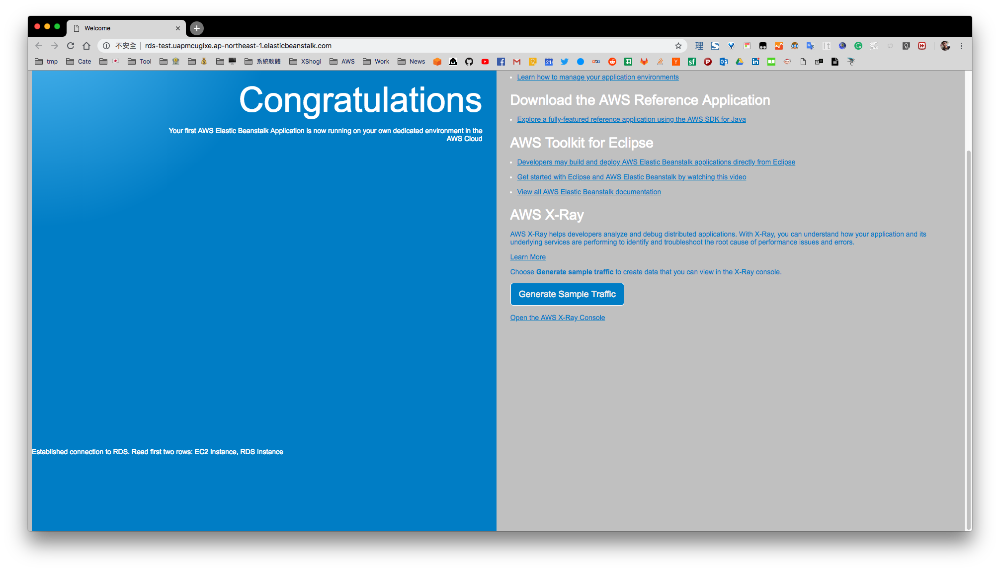

This project is a demostration for AWS ElasticBeanstalk Java Tomcat platform connecting to RDS MySQL instance.

The sample code[1] is running well and able to connect to external RDS instance on platform "Tomcat 8.5 with Java 8 running on 64bit Amazon Linux".

To confirm that the application is connected to RDS instances, as document[2] mentions, the following code snippet was added into index.jsp:

```jsp
<p>Established connection to RDS. Read first two rows: <%= results %></p>
```

And the result of successful connecting is:



## MySQL Connectoer/J

This bundle already had MySQL Connector/J[3] installed (in WEB-INF/lib). You can download the MySQL Connector/J with Platform Independent Zip Archive. 


## References
[1] [Java Tomcat sample code](https://docs.aws.amazon.com/zh_cn/elasticbeanstalk/latest/dg/samples/java-tomcat-v3.zip)
[2] [Connecting to a Database (Tomcat Platforms)](https://docs.aws.amazon.com/elasticbeanstalk/latest/dg/java-rds.html#java-rds-tomcat)
[3] [Download MySQL Connector/J](https://dev.mysql.com/downloads/connector/j/)